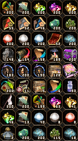
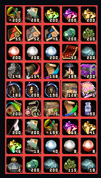
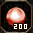

<div align="center">
  <a href="../"><b>⬅️ Back to Main M2Tracker Repository</b></a>
  <br><br>
  <a href="https://m2tracker.pages.dev/" target="_blank">
    
  </a>
</div>

<br>

# ⚔️ Metin2 Item-Recognition Pipeline: From Pixels to Profit

A high-performance, three-stage AI pipeline that turns raw game screenshots into structured, actionable item data - designed from the ground up for **web deployment**.

**The core idea:** instead of hardcoding slot coordinates or relying on brittle heuristics, this system *understands* the inventory the same way a player does - by looking at each icon and reading the quantity.

> **Practical goal:** plug this into a price database and get instant *"Total inventory / drop value"* - useful for valuing farm sessions, evaluating shop profitability, and tracking economic trends across servers.

---

## 🏎️ The 3-Stage Pipeline at a Glance

Each screenshot travels through three specialized stages:

```
Screenshot
    │
    ▼
┌───────────────────────────────────────┐
│  Stage A - YOLOv11n                   │
│  "Where are the items?"               │
│  → bounding boxes for each slot       │
└───────────────────┬───────────────────┘
                    │ slot crops (32×32)
                    ▼
┌───────────────────────────────────────┐
│  Stage B - MobileNetV2 + Embedding DB │
│  "What item is this?"                 │
│  → item_id / icon-group + similarity  │
└───────────────────┬───────────────────┘
                    │ item_id + crop
                    ▼
┌───────────────────────────────────────┐
│  Stage C - Template Matching (OCR)    │
│  "How many are there?"                │
│  → quantity (integer)                 │
└───────────────────┴───────────────────┘
```

### Visual Demo

| Input Screenshot | YOLO Slot Detection | Single Slot Crop |
| :---: | :---: | :---: |
|  |  |  |

### Final Output (JSON)

```json
{
  "item_id": 27994,
  "name":    "Blood Pearl",
  "quantity": 200
}
```

---

## 📊 Real-World Performance

A **500-iteration end-to-end stress test** (YOLO → CNN → OCR, fully in-game):

| Metric | Value |
|---|---|
| Total items placed | **15,771** |
| Correctly identified | **15,758** |
| Missed by YOLO | **4** |
| Wrong CNN match | **10** |
| **Overall accuracy** | ✨ **99.92%** |

> These numbers come from running the full pipeline live: YOLO detects slots, CNN identifies icons, OCR reads quantities.  
> Details and failure-case examples are in the individual stage READMEs.

---

## 🗂️ Stage Breakdown

### Stage A - Slot Detection ([`yolo/README.md`](yolo/README.md))

> **"Where are the items?"**

- Model: **YOLOv11n** (newest, smallest YOLO generation)
- Detects **single-slot item squares** on any screenshot; fully location-agnostic.
- Chosen over a classic grid-search so the same detector works on inventory, upgrade windows, shop panels, etc.
- Dataset: auto-generated screenshots (random item configurations + offsets) + a small manually labeled set with custom augmentation.
- Post-filter: rejects detections below a minimum size to eliminate partial-crop false positives.
- Model size: **~5 MB** (`.pt`) / **~10 MB** (`.onnx`)

**Key files:** `item_icon_getter.py` · `yolo_dataset_generator.py` · `train.py` · `test_model.py`

---

### Stage B - Icon Recognition ([`cnn/README.md`](cnn/README.md))

> **"What item is this?"**

- Model: **MobileNetV2** trained from scratch (no transfer learning), outputs a **256-dim L2-normalized embedding**.
- Architecture: *retrieval* (similarity search) instead of classic softmax classification.
- Matching: `similarities = query_embedding @ db_embeddings.T` - a single matrix multiply, fast on both CPU and GPU.

**Why embeddings?**

| Classic Classifier | Embedding Retrieval (this project) |
|---|---|
| Retrain on every new item | Add embeddings to DB - no retraining |
| One model per server | Same model, different embedding DB |
| Rigid N-class output | Returns top-k candidates + score |

**Robustness tricks:**
- Each DB entry is the *average* of multiple icon variations (different slot padding, random quantity overlays) → stable "center of gravity" per class.
- `embedding_size=256` + oversampling of hard pairs handles items that differ by only a single colored pixel.
- Items with **identical icons** (same pixels, different names) are grouped → model returns the group; the user picks the right one.

**DB format (web-export ready):**
- `*.bin` - concatenated Float32 embeddings
- `*.json` - metadata (embedding size + group mapping + pointer to `.bin`)

- Model size: **~10 MB** (`.pth` / `.onnx`)

**Key files:** `model.py` · `recognizer.py` · `tools_export_onnx.py` · `tools_prepare_embedding_db.py` · `demo_test_icon.py` · `demo_test_single_screenshot.py`

---

### Stage C - Quantity Reading ([`number_recognition/README.md`](number_recognition/README.md))

> **"How many are there?"**

- Method: **strict 1:1 template matching** (OpenCV `TM_SQDIFF_NORMED`).
- No neural network needed: Metin2's quantity font is pixel-perfect and consistent.
- Pipeline: crop bottom strip → grayscale → binarize → find contours → sort left→right → match each digit against templates `0..9`.
- Result: **100% accuracy** on tested servers (same rendering style = zero ambiguity).
- Adding new fonts: ship a new template set and select per server - no retraining.

**Key files:** `number_reader.py` · `number_templates/` · `demo_read_quantity.py`

---

## 🌍 Built for the Web from Day One

Every design decision was made with real-world deployment constraints in mind:

| Property | Value |
|---|---|
| Total model footprint | **~15 MB** (YOLO + CNN combined) |
| Inference target | CPU-only (no GPU required) |
| New item support | Add embeddings, no retraining |
| Multi-server support | Swap the embedding DB |
| Quantity model updates | Ship new digit templates |

---

## 📁 Repository Structure

```
AI_item_vision_pipeline/
├── images/                         # Pipeline demo images
│   ├── demo1.png                   # Raw input screenshot
│   ├── demo2.png                   # YOLO detection output
│   └── demo3.png                   # Single slot crop
│
├── yolo/                           # Stage A - Slot detection
│   ├── README.md
│   ├── item_icon_getter.py         # Inventory capture + slot-coordinate mapping
│   ├── yolo_dataset_generator.py   # Auto-generates labeled dataset
│   ├── train.py                    # Ultralytics training script
│   ├── test_model.py               # Inference + bounding-box export
│   └── docs/images/                # Detection examples
│
├── cnn/                            # Stage B - Icon recognition
│   ├── README.md
│   ├── model.py                    # MobileNetV2 embedding model
│   ├── recognizer.py               # DB builder + top-k matching
│   ├── train_metric_learning.py    # Metric-learning training
│   ├── tools_export_onnx.py        # ONNX export helper
│   ├── tools_prepare_embedding_db.py  # .pkl → .json + .bin export
│   ├── demo_test_icon.py           # Top-k recognition on single crop
│   ├── demo_test_single_screenshot.py # Full YOLO→CNN demo
│   └── images/                     # Hard-pair & failure examples
│
├── number_recognition/             # Stage C - Quantity OCR
│   ├── README.md
│   ├── number_reader.py            # NumberReader (template matching)
│   ├── number_templates/           # Digit PNGs: 0.png … 9.png
│   └── demo_read_quantity.py       # CLI demo
│
└── README.md                       # ← You are here
```

---

**Developed with ❤️ for the Metin2 Community.**  
Check the individual stage folders for training scripts, code, and implementation details.