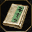
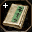
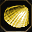
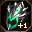
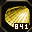
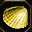
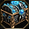
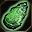
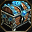
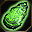

# 👁️ Icon Recognition (CNN Embeddings)

This folder contains the **second stage** of the Metin2 item-recognition pipeline - the module that answers the hardest question in the chain.

After YOLO identifies *where* the item slots are, this stage takes each 32×32 crop and identifies *what item it shows*. Instead of a rigid classifier, the system uses **Vector Retrieval** - generating a unique digital fingerprint (embedding) for every icon and comparing it against a known database.

> **Why this matters:** an embedding-based approach survives server updates, new items, and multi-server deployments without ever retraining the model. It also naturally handles the edge case where two different items share the exact same icon.

---

## 🌟 At a Glance

```
Slot crop (32×32)
        │
        ▼
┌───────────────────────────────────────┐
│  MobileNetV2 (trained from scratch)   │
│  → 256-dim L2-normalized embedding    │
└───────────────────┬───────────────────┘
                    │ query vector
                    ▼
┌───────────────────────────────────────┐
│  Embedding Database                   │
│  similarities = query @ db_emb.T      │
│  → top-k candidates + scores          │
└───────────────────┴───────────────────┘
```

|  |  |
|---|---|
| Backbone | **MobileNetV2** (trained from scratch) |
| Input size | **32×32** px |
| Embedding dim | **256** (L2-normalized) |
| Matching | dot product = cosine similarity |
| Model size | **~10 MB** (`.pth` / `.onnx`) |
| E2E accuracy | ✨ **99.92%** (over 15,000 items) |

---

## 🚀 Why Embeddings instead of Classic Classification?

> **"What item is this?"**

A standard softmax classifier outputs a fixed set of labels. If a new item appears, the whole model must be retrained.

**Why the embedding approach wins here:**

| Classic Classifier | Embedding Retrieval (this project) |
|---|---|
| Retrain on every new item | Add embedding to DB - no retraining |
| One model per server | Same model, swap the embedding DB |
| Rigid N-class output | Returns top-k candidates + similarity score |
| Can't handle identical icons | Groups identical icons naturally |

---

## 🧠 Architecture: MobileNetV2 (128 → 256 upgrade)

I chose **MobileNetV2** because it handles small inputs like 32×32 extremely well - and its compact size makes it a strong candidate for web deployment.

The model was trained **from scratch** (no transfer learning) on icon data sourced from multiple servers.

**Why 256 dimensions instead of 128?**

The first version used `embedding_size=128`. It worked well for the majority of icons, but failed on "Hard Pairs" - items that differ by only a single pixel detail or a small color shift. Doubling the embedding capacity gave the model enough room to separate these edge cases reliably.

Training data was generated with multi-server variety + oversampling of manually curated hard cases to ensure the model is pushed hardest on the trickiest distinctions.

---

## 🔍 The Key Discovery: Slot-Variance

A critical finding during development:

> **The same icon captured from different inventory slots is NOT byte-identical.**

Subtle UI rendering offsets mean that an icon in Slot 1 differs at the byte level from the same icon in Slot 7. This breaks any naive hashing or strict pixel-comparison approach.

This discovery had two separate consequences - and required two separate solutions:

### 1) Building the icon-group mapping (same icon, different items)

Some items share identical icons. To detect those reliably:
- Icons are compared **strictly within the same slot position** - this removes slot-dependent rendering noise.
- The result is a mapping: **`group_id → [list of possible items]`**.
- The frontend can present this list; the user picks the correct one.

### 2) Training the embedding model to be robust in practice

The training dataset was generated by an automatic script that:
- placed items across **many different slot positions** (intentionally),
- applied **random padding** (positional noise) around each crop,
- rendered **random stack quantities** as overlays.

This produces diverse 32×32 crops that closely match the variance seen in real gameplay screenshots.

---

## ⚔️ Hard Cases & Identical Icons

Metin2 icons are some of the hardest inputs for a vision model:
- Two different items can be **pixel-identical** (same art, different names).
- Two items can differ by **a single pixel detail** - a tiny color shift, a small glow, etc.

**How the model handles these:**

- **256-dim space** - enough capacity to capture subtle nuances.
- **Oversampling** - hard pairs appear more frequently during training, forcing the model to focus on the differences that matter.
- **Icon Groups** - pixel-identical items always produce the same embedding → the model retrieves the group representative, not a single name.

| Hard Cases (subtle differences) | Normal Examples |
|:---:|:---:|
|   |  |
|   |  |
|   |  |

---

## 🛠️ The "Centroid" Database Trick

The embedding DB doesn't store a single screenshot per icon - that would be fragile.

Instead, for each icon class/group:
1. Generate embeddings for **multiple variations** - different slot positions, different quantity overlays, small positional offsets.
2. Take the **average embedding** - the "Center of Gravity" for that class.
3. **L2-normalize** the result.

The averaged entry is far more stable: resistant to quantity overlays, slot rendering noise, and minor crop shifts. It behaves like the most "representative" version of the icon.

**DB format (web-export ready):**
- `*.bin` - concatenated raw Float32 embeddings (compact binary blob)
- `*.json` - metadata: embedding size, group mapping, pointer to `.bin`

See `tools_prepare_embedding_db.py`.

---

## ⚡ Matching: One Matrix Multiply

Matching is intentionally simple and fast. In `recognizer.py`:

```python
# All vectors are L2-normalized → dot product = cosine similarity
similarities = query_embedding @ db_embeddings.T
# Take top-k best matches
topk_indices = similarities.argsort()[-k:][::-1]
```

A single matrix multiplication scans the entire database in milliseconds - efficient on both **CPU and GPU**.

---

## 📈 End-to-End Performance

**500-iteration in-game stress test** (YOLO detections → CNN recognition):

| Metric | Value |
|---|---|
| Total items placed | **15,771** |
| Correctly identified | **15,758** |
| Incorrectly identified | **10** |
| Missed by YOLO | **4** |
| **Accuracy (Correct / Placed)** | ✨ **99.92%** |

### Wrong predictions (examples)

| pair A | pair B |
|---|---|
|  |  |
|  |  |

> Most remaining errors appear near the 32×32 information limit: some icons are so visually similar that even a strong model cannot separate them perfectly. This reflects a resolution bottleneck rather than a model flaw.

---

## 🌍 Web-Friendly by Design

Every choice in this stage optimized for real-world deployment:

| Property | Value |
|---|---|
| Model size | **~10 MB** (`.pth` / `.onnx`) |
| Inference target | CPU-only (no GPU required) |
| New item support | Generate embedding, update DB - no retraining |
| Multi-server support | Swap the embedding DB per server |
| DB format | Compact `.bin` + lightweight `.json` metadata |

---

## 📁 Folder Structure

```
cnn/
├── model.py                        # MobileNetV2 backbone (no softmax)
├── recognizer.py                   # Embedding DB builder + top-k matching
├── train_metric_learning.py        # Metric-learning training script
├── dataset.py                      # Dataset loader for training
├── tools_export_onnx.py            # ONNX export helper
├── tools_prepare_embedding_db.py   # .pkl → .json + .bin web export
├── demo_test_icon.py               # Top-k recognition on a single crop
├── demo_test_single_screenshot.py  # Full YOLO → crops → CNN demo
└── images/                         # Hard-pair & failure examples
```

**Key files:** `model.py` · `recognizer.py` · `tools_prepare_embedding_db.py` · `demo_test_single_screenshot.py`

---

## 🔮 What's Next

Possible improvements if the project evolves further:

- **Super-resolution preprocessing** - upscale 32×32 crops before embedding to push past the current accuracy ceiling (trade-off: larger model, slower inference).
- **Heavier backbone** - EfficientNet or a ViT patch encoder might squeeze out the last 0.08%, at a cost in model size.
- **Active-learning loop** - collect real-game screenshots of misidentified items and add them to the hard-pair set automatically.
- **Confidence threshold UI** - surface the similarity score to the user so they know when the model is uncertain.
- **Per-server DB hot-swap** - allow the web client to switch embedding DBs dynamically when the player changes server.

---

## 🛡️ Known Limitations

| Limitation | Root Cause | Mitigation |
|---|---|---|
| ~0.08% misidentification rate | 32×32 resolution limit for near-identical icons | User override in UI |
| Group output instead of single name | Items are pixel-identical by design | Show group list; use context to decide |
| Quantity overlays can lower similarity | Large stack numbers obscure icon pixels | Centroid averaging reduces impact |
| New server fonts / rendering styles | Slot-variance differs per client version | Regenerate embedding DB for that server |

---

**Part of the Metin2 Item-Recognition Pipeline.**  
← Back to the [pipeline overview](../README.md) · Next stage: [Quantity Reading](../number_recognition/README.md)