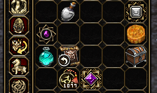
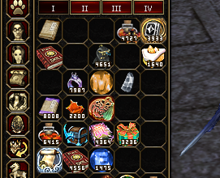
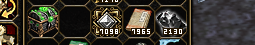
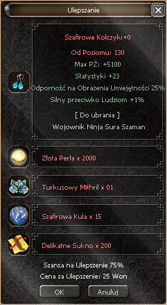
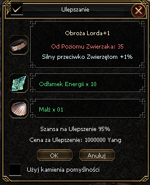
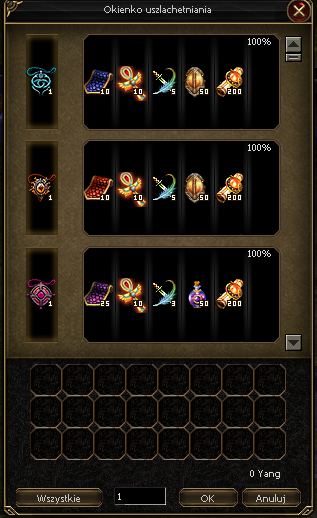
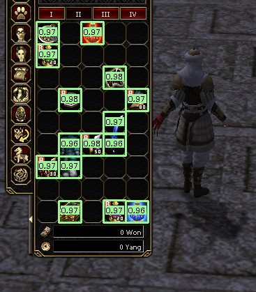
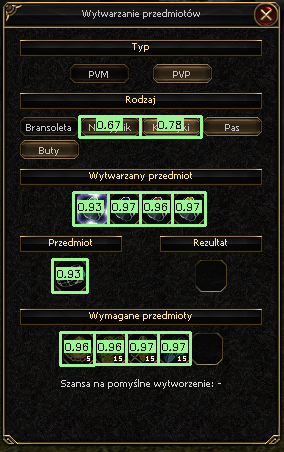
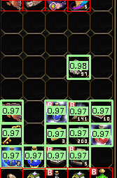

# 🎯 Slot Detection (YOLOv11n)

This folder contains the **first stage** of the Metin2 item-recognition pipeline - the module that finds *where* the items are before anything else can happen.

Given a raw game screenshot, this stage detects every single-slot item square visible on screen and returns its bounding box. Everything downstream - icon recognition and quantity reading - depends on the quality of these detections.

> **Why a detector instead of hardcoding grid coordinates?** The goal is broad UI coverage: inventory, upgrade windows, shop panels, and future screens. A learned detector keeps one detection path while layout differences are handled through data, not custom code.

---

## 🌟 At a Glance

```
Screenshot (any resolution)
        │
        ▼
┌───────────────────────────────────────┐
│  YOLOv11n                             │
│  → bounding boxes [x, y, w, h, conf] │
└───────────────────┬───────────────────┘
                    │
                    ▼
         Post-filter: reject boxes
         below min_width / min_height
                    │
                    ▼
         Slot crops → Stage B (CNN)
```

| Property | Value |
|---|---|
| Model | **YOLOv11n** (newest, smallest YOLO generation) |
| Classes | **1** (`item`) |
| Target | Single-slot item squares only |
| Post-filter | Minimum width/height in pixels |
| Model size | **~5 MB** (`.pt`) / **~10 MB** (`.onnx`) |
| Inference | Fast on **CPU and GPU** |

---

## 🚀 Why YOLO instead of a Grid Search?

> **"Where are the items?"**

Grid parsing is deterministic and fast, but tightly coupled to one known layout. In this project, portability across servers and UI panels matters more, so YOLO is used as a layout-agnostic locator before CNN/OCR stages.

**Why a learned detector wins here:**

| Hardcoded Grid | YOLOv11n (this project) |
|---|---|
| Breaks on window resize or offset | Location-agnostic |
| Inventory only | Works on any UI panel with item slots |
| Needs manual calibration per server | Learns from data |
| Zero false positives on known grid | Handles overlapping / partial slots |
| Instant | Fast - sub-100ms on CPU |

---

## 🧠 Model Choice: YOLOv11n vs YOLOv8s

I trained and compared two variants:

| Model | Accuracy | Size (`.pt`) | Notes |
|---|---|---|---|
| **YOLOv8s** | ✅ Good | ~22 MB | Heavier, more parameters |
| **YOLOv11n** | ✅ Same | ~5 MB | **4× smaller, same quality** |

**YOLOv11n** was chosen because it matched the accuracy I needed at a fraction of the weight - critical for web deployment where download size and inference time matter.

---

## 🗃️ Dataset: Generated + Real Screenshots

The dataset has two components, each chosen deliberately:

### 1) Automatically Generated Data (primary source)

An automatic script (`yolo_dataset_generator.py`) fills the inventory with random items in random configurations, then:

- captures screenshots,
- exports YOLO-format labels (bounding boxes),
- uses `item_icon_getter.py` to capture slot regions and map per-slot coordinates,
- applies **random padding and offsets** around the captured region.

The random padding is intentional - it acts as "controlled noise" and teaches the model that UI clutter surrounding item slots is normal and should be ignored.

| generated #1 | generated #2 | generated #3 |
|---|---|---|
|  |  |  |

### 2) Manually Collected & Labeled Screenshots (important extras)

A small set of **real in-game screenshots** was collected and labeled by hand. These capture edge cases and rendering details that the auto-generator doesn't reproduce perfectly.

| manual #1 | manual #2 | manual #3 |
|---|---|---|
|  |  |  |

### 3) Custom Augmentation for Manual Data

Manual screenshots are expensive to collect. To maximise their value, a custom augmentation strategy is applied:

- cut each screenshot into multiple smaller fragments,
- vary crop positions and offsets to generate diverse views,
- feed all fragments to training as independent examples.

A small hand-labeled set effectively behaves like a much larger dataset this way.

---

## 🔍 The Post-Filter: Eliminating Tiny False Positives

During testing I noticed a failure mode: the detector occasionally fires on **small fragments of an icon** - partial bounding boxes that are too small to be real item slots.

Since inventory item slots have a **stable, known pixel size**, the fix is simple and effective:

```python
# In test_model.py
filtered = [
    box for box in detections
    if box.w >= min_width and box.h >= min_height
]
```

Detections below the minimum size threshold are discarded. Because legitimate slots are always at least a certain size, this filter has zero impact on true positives and eliminates spurious partial detections.

---

## 📈 Results

### In-domain (inventory screenshots)

On regular inventory screenshots matching the training distribution, results are **near-perfect**. The detector reliably finds every occupied slot even with different item icons, varying stack quantities, and partial UI overlaps.

| detection #1 | detection #2 | detection #3 |
|---|---|---|
|  |  |  |

### Out-of-domain (other UI windows)

On other panels (upgrade windows, shop windows), the detector still performs usefully - but errors do occur. The main constraint is data volume: collecting and auto-generating diverse "non-inventory" examples is harder than it sounds.

**End-to-end test (YOLO + CNN + OCR, 500 iterations):**

| Metric | Value |
|---|---|
| Total items placed | **15,771** |
| Missed by YOLO | **4** |
| **Detection rate** | **99.97%** |

---

## 🌍 Web-Friendly by Design

| Property | Value |
|---|---|
| Model size | **~5 MB** (`.pt`) / **~10 MB** (`.onnx`) |
| Inference target | CPU-only (no GPU required) |
| New UI panel support | Collect + label examples, re-train |
| Post-filter | Configurable `min_width` / `min_height` per screen resolution |

---

## 📁 Folder Structure

```
yolo/
├── item_icon_getter.py         # Inventory capture + slot-coordinate mapping helpers
├── yolo_dataset_generator.py   # Auto generates screenshots + YOLO labels
├── train.py                    # Ultralytics training script
├── test_model.py               # Inference on screenshots + bbox export
└── docs/
    └── images/                 # Generated, manual & detection examples
```

**Key files:** `item_icon_getter.py` · `yolo_dataset_generator.py` · `train.py` · `test_model.py`

---

## 🔮 What's Next

Possible improvements if the project evolves further:

- **More non-inventory data** - the highest-value improvement: collect and label examples from upgrade windows, shop panels, and warehouse to reduce out-of-domain errors.
- **Multi-slot item class** - add a second YOLO class (`item_2slot`) to handle items that occupy two inventory squares, currently ignored on purpose.
- **Resolution robustness** - test at 1.5× and 2× UI scales; adjust `min_width`/`min_height` thresholds or add resolution-aware post-filtering.
- **Confidence calibration** - tune the confidence threshold per UI context (lower threshold for sparse windows, higher for crowded inventories).

---

## 🛡️ Known Limitations

| Limitation | Root Cause | Mitigation |
|---|---|---|
| Out-of-domain UI panels | Less training data for non-inventory windows | Collect & label more diverse screenshots |
| Multi-slot items fire as 1–2 single-slot boxes | Only one class (`item`) trained | Add `item_2slot` class or second pass |
| Text/grid UI panels trigger detections | Some non-item UI elements look like slot grids | Post-filter by size + human review pass |
| Large "stitched" screenshots | Effective scale changes outside normal resolution range | Enforce reasonable input resolution |

**Recommended UX approach:**
- Show the user a **visual preview of all detections** (with bounding boxes).
- Keep the confidence threshold fairly low - better to surface a few extra boxes than to miss real items.
- Allow **manual removal** of false positives before feeding results to the CNN stage.

---

**Part of the Metin2 Item-Recognition Pipeline.**  
← Back to the [pipeline overview](../README.md) · Next stage: [Icon Recognition](../cnn/README.md)
