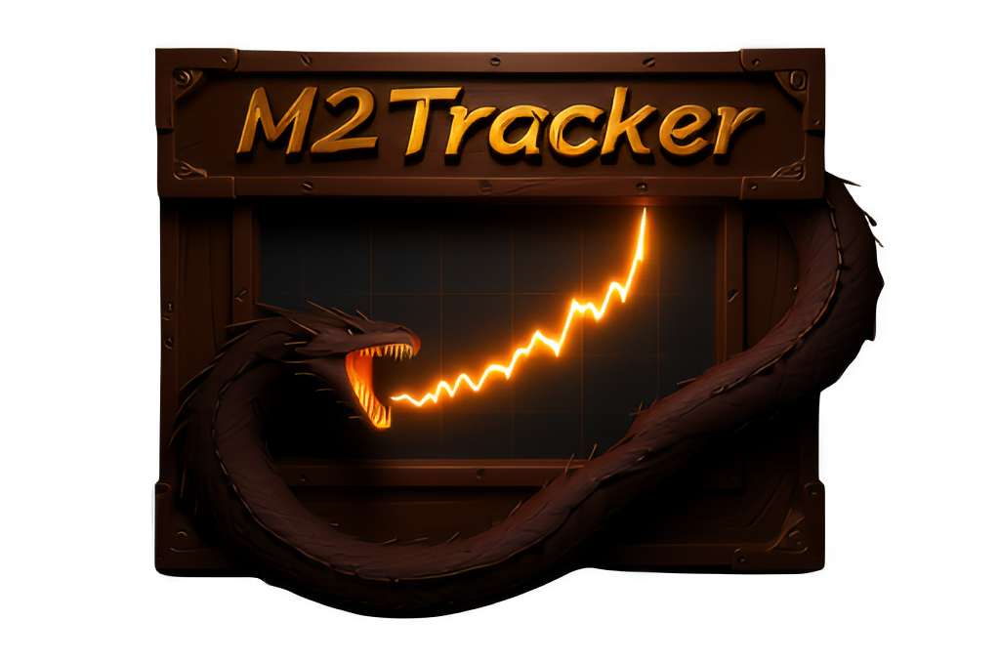
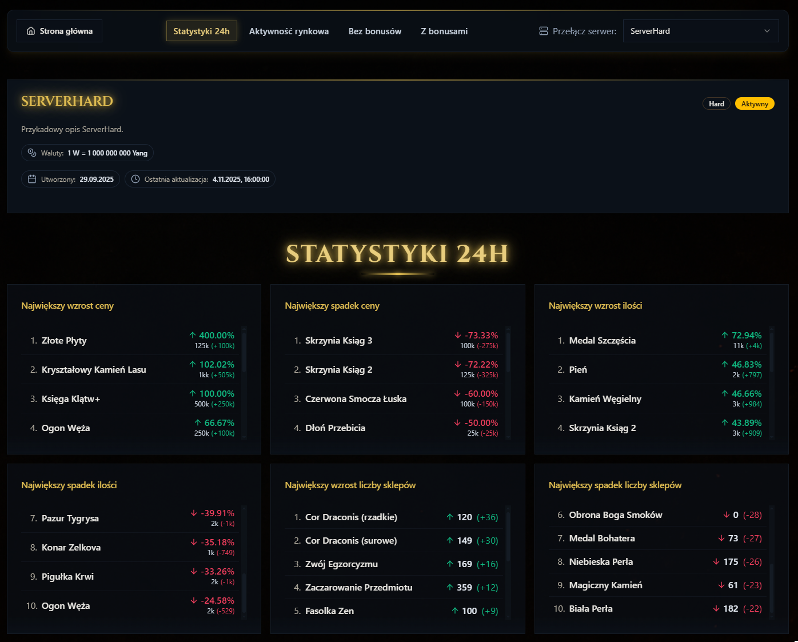
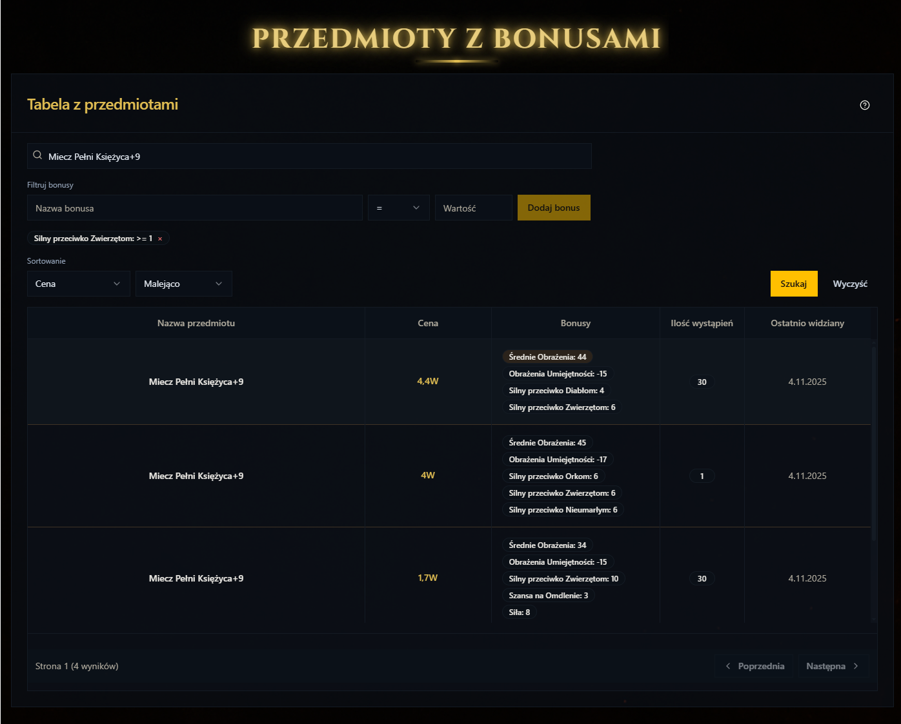
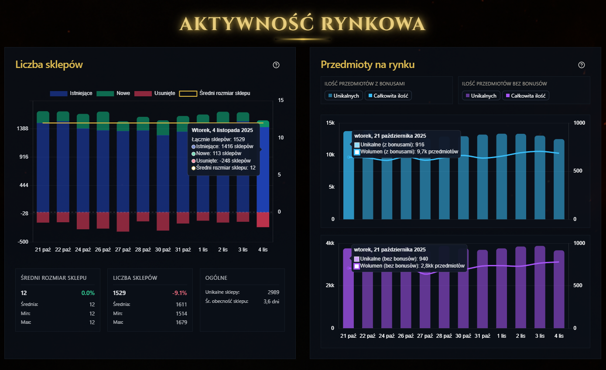
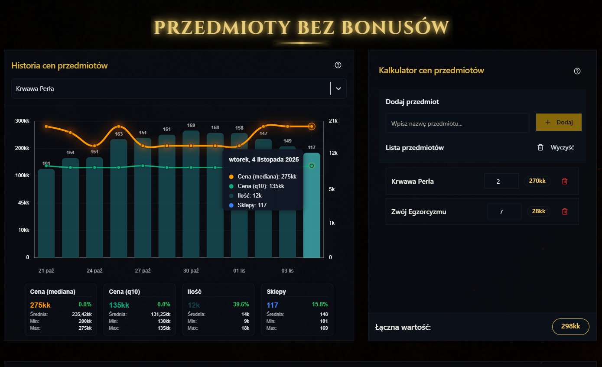

  
  
   
  <h3>Market intelligence for Metin2 private servers.</h3>
  
<i>From in-game market extraction to secure analytics dashboards and in-browser AI valuation.</i>

   
  
  
  <h4>✅ No account required &nbsp; | &nbsp; ✅ Full feature access &nbsp; | &nbsp; 💡 Runs safely on mock data</h4>

 

---

## 🚀 Welcome to M2Tracker

M2Tracker is not just a scraper or a simple web app. It is a **production-grade, full-stack ecosystem** built to extract, process, and beautifully display market data from Metin2 game clients. 

Designed with an absolute obsession over **anti-scraping security**, **machine learning**, we bridge the chaotic in-game economy with structured, interactive web analytics. Whether you want to quickly evaluate your farm session with an AI screenshot calculator or track multi-million currency market trends, M2Tracker provides the ultimate toolset.

  <video src="https://github.com/user-attachments/assets/657531b5-a621-423b-8147-f72d96609195" autoplay loop muted playsinline width="980"></video>

---

## 🔥 Features that Shine

### 🧠 Serverless AI Inventory Valuation
Simply paste or upload a screenshot of your inventory. Our custom-trained AI pipeline (YOLOv11n + MobileNetV2 + OCR) runs **entirely in your browser** to identify items, read quantities, and calculate the exact market value of your loot in seconds. It's the ultimate tool to evaluate your grinding sessions instantly and with near-perfect accuracy.

  <video src="https://github.com/user-attachments/assets/64353d8f-7f73-43ee-94f2-2adf4538ae54" autoplay loop muted playsinline width="980"></video>

> **[🧠 Dive deeper into the AI Vision Pipeline ➔](AI_item_vision_pipeline/README.md)**

### 📈 Advanced Dashboards & Analytics
Sort, filter, and track thousands of items. Watch the supply and demand of rare bonus items in real-time. The UI is lightning fast, featuring server-side pagination, debounced API calls, and complex dynamic filtering. Dive deep into historical price charts to predict market drops, compare stat variations, and calculate exact profit margins before making a trade.

  
  

  
  

> **[🖥️ Explore the Frontend SPA & UI components ➔](frontend/README.md)**

### 🛡️ "Ghost Charts" & Military-Grade Security
Market data is gold, and bots want it. M2Tracker defends its data by rendering charts using an `OffscreenCanvas` buried inside an isolated **Web Worker**. Malicious scrapers inspecting the DOM see absolutely nothing but an empty canvas. Cryptographic keys (ECDH, AES-GCM) never even touch the main UI thread.

> **[🔐 Read up on the secure Backend architecture ➔](backend/README.md)**

### 👾 Automated In-Game Extraction Pipeline
The backend is fueled by a headless Python agent that directly hooks into the game's memory. It physically teleports around the map, opens shops, bypasses interaction limits, and forces the game rendering engine to reveal hidden item metadata (like specific bonuses and slot sizes) via chat links.

> **[⚙️ Learn how the Data Engine extracts memory ➔](market_data_pipeline/README.md)**

---

## 🧩 Architecture & Deep Dives

The system is highly decoupled into four primary engineering pillars. **If you want to dive into the technical wizardry, check out the dedicated technical documentation for each module:**

| Module | Description | Learn More |
|--------|-------------|------------|
| **🖥️ Frontend** | React 18 SPA, Web Workers, ZRender Ghost Charts. The safest, smoothest UI on the market. | [Explore Frontend ➔](./frontend) |
| **🔐 Backend** | FastAPI, Redis, MySQL. Cryptographic request signing, Turnstile auth, ECDH handshakes. | [Explore Backend ➔](./backend) |
| **👁️ AI Vision** | Machine learning pipeline (YOLOv11n + MobileNetV2 + OCR) driving the screenshot calculator. | [Explore AI Pipeline ➔](./AI_item_vision_pipeline) |
| **⚙️ Data Engine**| Python memory integration, ETL process, innovative automated metadata extraction. | [Explore Scraper ➔](./market_data_pipeline) |

---

## 🛠️ Tech Stack Highlights

---

  <i>"Turning chaotic pixel economies into actionable market intelligence."</i>  
  
  
  <h4>✅ No account required &nbsp; | &nbsp; ✅ Full feature access &nbsp; | &nbsp; 💡 Runs safely on mock data</h4>

