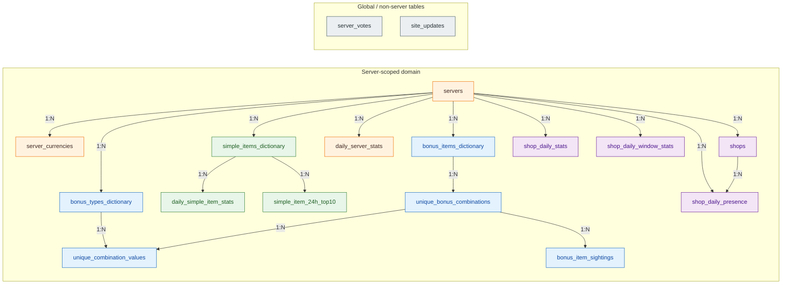

<div align="center">
  <a href="../"><b>⬅️ Back to Main M2Tracker Repository</b></a>
  <br><br>
  <a href="https://m2tracker.pages.dev/" target="_blank">
    
  </a>
</div>

<br>

# 🛡️ M2Tracker Backend

A production-minded analytics backend for Metin2 market data - designed to be fast under load, hard to abuse, and easy to operate on mainstream hosting setups.

This service ingests market snapshots from game servers, normalises them, and serves low-latency APIs to dashboards and automation clients. The engineering focus goes significantly beyond basic CRUD: request-level cryptographic signing, ECDH key exchange, Redis-backed replay prevention, and Prometheus observability are all first-class concerns, not afterthoughts.

> **The core challenge:** market data APIs are frequent bot targets. This backend treats every API consumer as potentially adversarial and enforces that assumption at the protocol level - before any business logic runs.

---

## 🌟 At a Glance

```
HTTP Request
      │
      ▼
┌──────────────────────────────────────────────┐
│  FastAPI Middleware Stack                    │
│  ┌──────────────────────────────────────┐    │
│  │  SecurityHeadersMiddleware           │    │
│  │  HSTS · CSP · X-Frame · no-sniff     │    │
│  ├──────────────────────────────────────┤    │
│  │  MetricsMiddleware                   │    │
│  │  Latency + request correlation       │    │
│  ├──────────────────────────────────────┤    │
│  │  SigVerificationMiddleware           │    │
│  │  Bearer sid → session lookup (Redis) │    │
│  │  X-TS clock skew · X-Nonce replay    │    │
│  │  HMAC-SHA256 canonical verify        │    │
│  └──────────────────────────────────────┘    │
└──────────────────┬───────────────────────────┘
                   │ request.state.secure_session
                   ▼
┌──────────────────────────────────────────────┐
│  Route Layer  (FastAPI routers)              │
│  /auth/*  ·  /api/v1/*  ·  /internal/*       │
└──────────────────┬───────────────────────────┘
                   │
                   ▼
┌─────────────────────────────────────────────┐
│  Repository Layer                           │
│  ┌─────────────────┐  ┌─────────────────┐   │
│  │                 │  │     Redis       │   │
│  │      MySQL      │  │  search indices │   │
│  │                 │  │  session store  │   │
│  │                 │  │  nonce keys     │   │
│  └─────────────────┘  └─────────────────┘   │
└─────────────────────────────────────────────┘
```

| Property | Value |
|---|---|
| Framework | **FastAPI** (async, Python) |
| Primary DB | **MySQL** (SQLAlchemy ORM) |
| Cache / Session / Search | **Redis** (redis-py asyncio client) |
| Auth | Turnstile → X25519 ECDH → HKDF → HMAC-SHA256 |
| Observability | Prometheus metrics + structured JSON logs |
| Rate limiting | Redis-backed (`slowapi`) |
| Platform | Windows (Uvicorn) / Linux (Gunicorn + Uvicorn workers) |

---

## 🔐 Security Architecture

This backend uses layered controls. The threat model assumes that market APIs attract automated abuse - scrapers, replay attackers, and session hijackers - and every layer is designed with a specific threat in mind.

### Layer 1 - Session Bootstrap (`POST /auth/dashboard`)

> **"Prove you're a human, then let's establish shared secrets."**

```
Client                              Server
  │                                   │
  │──── Cloudflare Turnstile token ──►│  ① _verify_turnstile()
  │     + X25519 client public key    │
  │                                   │
  │                                   │  ② _perform_ecdh_and_derive_keys()
  │                                   │     server generates ephemeral X25519 keypair
  │                                   │     shared_secret = server_priv.exchange(client_pub)
  │                                   │     salt = secrets.token_bytes(16)
  │                                   │     key_enc = HKDF-SHA256(shared_secret, info=b"keyEnc")
  │                                   │     key_sig = HKDF-SHA256(shared_secret, info=b"keySig")
  │                                   │
  │◄─── server_pubkey + salt + sid ───│  ③ session stored in Redis HASH
  │     + TTL                         │     main_keys: {key_sig, key_enc}
  │                                   │     created_at, last_active, session_bind_hash
```

HKDF derives **two independent keys from one shared secret** - one for encryption (`key_enc`) and one for signing (`key_sig`) - using distinct `info` labels. Neither key is ever transmitted directly.

**Session binding (optional):** at creation time, `SHA256(masked_client_IP)` is stored in the Redis session hash. Every subsequent request recomputes the hash and compares it with `hmac.compare_digest()`. This prevents session reuse from a different network.

**Per-IP session cap:** Redis sorted sets (`ZADD`, `ZRANGE`) track active sessions per IP. When the cap is exceeded, the oldest sessions (and their associated nonce keys) are evicted atomically via a pipeline.

### Layer 2 - Signed Request Verification (`SigVerificationMiddleware`)

Every request to a "secure path" must carry four additional fields:

```
Authorization: Bearer <sid>
X-Sig:   base64url(HMAC-SHA256(key_sig, canonical_string))
X-TS:    <unix_timestamp_ms>
X-Nonce: <single-use random token>
```

**Canonical string** (assembled in `_build_canonical`):

```
METHOD|/path|base64url(sha256(body))|timestamp_ms|nonce
```

**Verification chain** (in order, fail-fast):

| Step | Check | Failure reason |
|---|---|---|
| 1 | `Authorization: Bearer <sid>` present and valid format | `missing_auth_header` / `invalid_auth_header` |
| 2 | Redis `HGETALL` session exists and is not empty | `invalid_sid` |
| 3 | Session binding hash matches (if enabled) | `session_binding_failed` |
| 4 | `now_ms < created_at + max_age_ms` | `session_expired_max_age` |
| 5 | `now_ms < last_active + ttl_ms` | `session_expired_inactivity` |
| 6 | Worker key path → worker keys present and not expired | `worker_keys_missing` / `worker_keys_expired` |
| 7 | `abs(now_ms - X-TS) ≤ skew_tolerance_ms` | `xts_skew` |
| 8 | `X-Nonce` present | `missing_nonce` |
| 9 | Compute canonical → HMAC → `hmac.compare_digest(mac_b64, X-Sig)` | `invalid_xsig` |
| 10 | `SET NX nonce:{sid}:{nonce} EX ttl` - must return True | `replay_detected` |
| 11 | `HSET session last_active now_ms` | - |

Step 9 uses **constant-time comparison** (`hmac.compare_digest`) to eliminate timing side-channels. Step 10 is the anti-replay gate - Redis `SET NX` is atomic, guaranteeing each nonce can only be consumed once.

### Layer 3 - Secondary Worker Keys (`POST /auth/chart-worker`)

Chart web workers require a separate, **short-lived key set** with a distinct TTL. This endpoint:
- requires a valid **main session signature** (X-Sig) to authorize the upgrade,
- performs a fresh ECDH handshake with `info=b"keyEnc_worker"` / `info=b"keySig_worker"`,
- stores `worker_keys` alongside `worker_keys_expires_at` in the existing Redis session hash.

Worker-key paths are configured separately (`worker_key_paths`) and the middleware selects the correct key set automatically.

### Layer 4 - Internal Surface Hardening

| Control | Implementation |
|---|---|
| Docs / metrics / internal routes | `X-API-Key` header gate |
| Security response headers | `SecurityHeadersMiddleware` (HSTS, CSP, `X-Frame-Options`, `X-Content-Type-Options`) |
| Rate limiting | Redis-backed `slowapi`, configurable per endpoint |
| Error responses | All auth failures return `{"detail": "Failed to pass verification"}` - no information leakage |
| Prometheus failures counter | `AUTH_FAILURES_TOTAL.labels(path=..., reason=...)` - reason never reaches the client |

### Threat → Control Map

| Threat | Control |
|---|---|
| Request tampering | HMAC-SHA256 over canonical request (body hash included) |
| Replay attacks | Single-use nonce + `SET NX` in Redis + timestamp window |
| Session theft / reuse | Session binding hash (masked IP, SHA256, constant-time compare) |
| Automated auth abuse | Cloudflare Turnstile + rate limiting (5/min per IP) |
| Session accumulation per IP | Per-IP sorted set cap; oldest sessions evicted atomically |
| Internal endpoint scraping | `X-API-Key` gate on `/internal/*`, `/docs`, `/metrics` |
| Timing attacks on signatures | `hmac.compare_digest()` on every sensitive comparison |
| AI asset key leakage | Key delivered encrypted with session `key_enc` (AES-GCM, random 12-byte IV) |

---

## 🗄️ Database Strategy

### Why MySQL (not PostgreSQL)

This was a deliberate deployment decision, not a technology preference argument.

- Shared hosting and mainstream VPS panels provide MySQL out of the box - reducing infrastructure friction for the target deployment tier.
- The domain model fits MySQL perfectly: relational constraints, composite primary keys, daily aggregations, and indexed range lookups.
- Full-text search is **not used** for item lookup - that pressure is offloaded to Redis entirely.

### MySQL + Redis: Division of Responsibility

```
┌────────────────────────────────────────────────────┐
│  MySQL  (source of relational truth)               │
│  • All persistent data (servers, items, stats)     │
│  • Composite FK constraints                        │
│  • Daily aggregations, time-series                 │
└────────────────────────────────────────────────────┘

┌────────────────────────────────────────────────────┐
│  Redis  (speed layer + ephemeral state)            │
│  • Search indices (ZSCAN substring matching)       │
│  • Session store (HASH per sid, TTL expiry)        │
│  • Nonce keys (SET NX, auto-expiring)              │
│  • Per-IP session tracking (sorted sets)           │
└────────────────────────────────────────────────────┘
```

### Item Search: Redis ZSCAN

MySQL `LIKE '%substring%'` queries are slow by nature - they can't use B-tree indices. Instead, item names are indexed in Redis sorted sets at startup and refreshed on-demand:

```python
# Index format: "item name lowercase::vid" stored as sorted set member (score=0)
# e.g. "blood pearl::27994"

# Search: ZSCAN with glob pattern *substring*
async for member, _score in redis.zscan_iter(key, match=f"*{q.lower()}*"):
    name_lower, vid_str = member.rsplit("::", 1)
    results.append((capitalize(name_lower), int(vid_str)))
```

**Rebuilding** uses a temp-key rename (`RENAME`) pattern to make index swaps atomic - no client ever reads a half-built index.

**Graceful degradation:** if Redis is unavailable, repositories fall back to SQL-based lookups. The API stays functional, just slightly slower.

---

## 📐 Data Model

Source of truth: `backend/db/models.py`



**Key design decisions:**
- Bonus combinations are **deduplicated by hash** (`SHA-256` of the sorted bonus list). The same combination seen on different days points to the same row - sightings fan out from it.
- `DECIMAL(50, 0)` for Metin2 prices - the in-game currency can reach values that overflow standard `BIGINT`.
- `SimpleItem24hTop10` stores pre-computed rankings per `metric_type` string - avoids expensive `ORDER BY` on the full stats table for hot dashboard queries.
- All composite indices follow query access patterns (e.g. `(server_id, item_vid, date)` for time-series lookups).

---

## 📡 API Surface

| Prefix | Purpose | Auth |
|---|---|---|
| `/auth/dashboard` | Turnstile + ECDH session bootstrap | Public (rate-limited) |
| `/auth/chart-worker` | Secondary ECDH key set for workers | X-Sig (main session) |
| `/auth/logout` | Session invalidation | X-Sig |
| `/auth/status` | Session liveness check | X-Sig |
| `/auth/ai` | Encrypted AI asset key delivery | X-Sig |
| `/api/v1/*` | Market data (items, stats, shops, servers) | X-Sig |
| `/internal/*` | Cache invalidation, admin ops | X-API-Key |
| `/metrics` | Prometheus scrape endpoint | X-API-Key |
| `/docs` | OpenAPI docs (API-key protected, hidden from schema) | X-API-Key |

---

## 📊 Observability

Prometheus metrics are instrumented across all critical paths in `core/metrics.py`:

| Metric | What it tracks |
|---|---|
| `http_requests_total` | Requests by method, path, status |
| `http_request_duration_seconds` | Latency histogram per endpoint |
| `http_requests_in_progress` | Live request gauge |
| `auth_failures` | Auth failures by path + reason (never reaches clients) |
| `db_execute_seconds` | Query latency by operation |
| `db_pool_*` | Connection pool health |

Every request gets a unique `X-Request-ID` (set if missing) and logs include it for correlation. Response headers always include `X-Process-Time`.

---

## 🚀 Quickstart (Windows / PowerShell)

Run from the repository root (the directory containing `backend/`):

```powershell
# 1. Start MySQL + Redis
docker compose -f backend/docker-compose.dev.yml up -d


# 2. Install dependencies
python -m pip install -r backend/requirements.txt

# 3. Run the API
python -m uvicorn backend.main:app --host 127.0.0.1 --port 8000 --reload

# 4. Verify
curl http://127.0.0.1:8000/api/v1/health
```

**Running tests:**
```powershell
# Unit tests
python -m pip install -r backend/requirements.txt pytest pytest-asyncio
python -m pytest backend/tests/unit -q

# Integration tests (requires backend/docker-compose.test.yml services up)
python -m pip install -r backend/requirements.txt pytest pytest-asyncio httpx
python -m pytest backend/tests/integration -q
```

---

## 📁 Project Structure

```
backend/
├── docker-compose.dev.yml      # Local MySQL + Redis for development
├── docker-compose.test.yml     # Isolated MySQL + Redis for integration tests
├── main.py                     # App factory: middleware, routers, startup/shutdown
├── config.py                   # Dataclass settings - all config from environment
├── run.py                      # Entry point (Uvicorn / Gunicorn dispatch)
│
├── core/
│   ├── database.py             # SQLAlchemy engine + SessionLocal + pooling
│   ├── redis_client.py         # Async Redis init/close + get_redis()
│   ├── metrics.py              # Prometheus counters, histograms, gauges
│   ├── logging.py              # Structured JSON logger + request correlation
│   ├── exceptions.py           # Domain exceptions + FastAPI exception handlers
│   ├── middleware.py           # Middleware registration order
│   ├── security.py             # X-API-Key gate helper
│   ├── limiter.py              # slowapi rate limiter instance
│   ├── encoding.py             # base64url encode/decode helpers
│   └── request_utils.py        # get_client_ip, get_masked_ip
│
├── middlewares/
│   ├── sig_verification.py     # ★ SigVerificationMiddleware (HMAC, nonce, binding)
│   ├── security_headers.py     # HSTS, CSP, X-Frame-Options, no-sniff
│   ├── logging.py              # Request/response logging middleware
│   └── cache.py                # Cache-Control response header middleware
│
├── routes/
│   ├── api.py                  # Aggregates and mounts API v1 subrouters
│   ├── auth.py                 # ★ ECDH session bootstrap + worker keys + AI key
│   ├── simple_items.py         # Item search, price history, top-10 rankings
│   ├── bonus_items.py          # Bonus item search, combination lookup
│   ├── stats.py                # Server + daily market statistics
│   ├── dashboard.py            # Aggregated dashboard data
│   ├── homepage.py             # Server votes + site updates
│   ├── internal.py             # Cache invalidation (X-API-Key gated)
│   ├── feedback.py             # User feedback ingestion
│   ├── bug_reports.py          # Bug report ingestion
│   ├── schemas/                # Pydantic request/response models
│   └── utils/                  # Route-level helpers (cache, encryption, parsing)
│
├── repos/
│   ├── manager.py              # RepositoryManager - single access point
│   ├── base.py                 # BaseRepository (shared DB session helpers)
│   ├── simple_items.py         # Simple item CRUD + Redis search index
│   ├── bonus_items.py          # Bonus item + combination + sighting logic
│   ├── servers.py              # Server + currency + stats queries
│   ├── stats.py                # Daily stats + rolling window aggregates
│   ├── search_helpers.py       # ★ ZSCAN index build/query helpers
│   ├── feedback.py             # Feedback persistence
│   └── bug_reports.py          # Bug report persistence
│
├── tests/
│   ├── conftest.py
│   ├── integration/
│   │   └── test_smoke_and_suggest.py
│   └── unit/
│       ├── test_cache_utils.py
│       ├── test_common_utils.py
│       ├── test_request_utils.py
│       └── test_security.py
│
├── utils/
│   └── image_processing.py
│
└── db/
    └── models.py               # ★ SQLAlchemy ORM - single source of schema truth
```

**★ = files worth reading first** if you want to understand the project's most interesting engineering decisions.

---

**Part of the M2Tracker project.**  
See also: [AI Item Recognition Pipeline](../AI_item_vision_pipeline/README.md)
